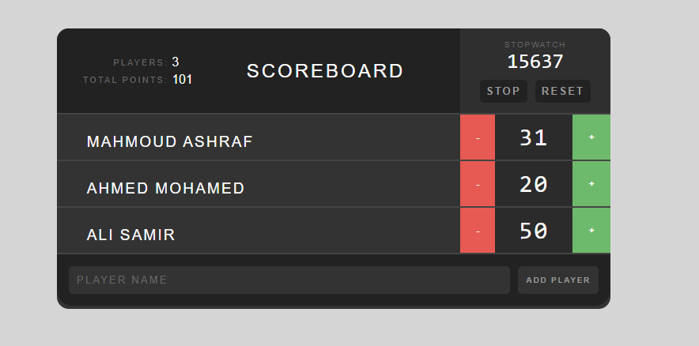

Inspired by Taskify


# 🏆 Scoreboard App

A simple, interactive scoreboard built with **React** and **TypeScript**. Inspired by **Taskify** and the **Scoreboard App from Teahouse**.




## 🚀 Getting Started

Follow these steps to create and launch the project from scratch.

### 1. Create the App

Use Create React App with the TypeScript template:

```bash
npx create-react-app scoreboard-ts --template typescript
cd scoreboard-ts


###   Git Commands

git init

git remote add origin https://github.com/your-username/scoreboard-ts.git

    For Pushing Everytime

git add .

git commit -m "Basic App"

git push -u origin main

